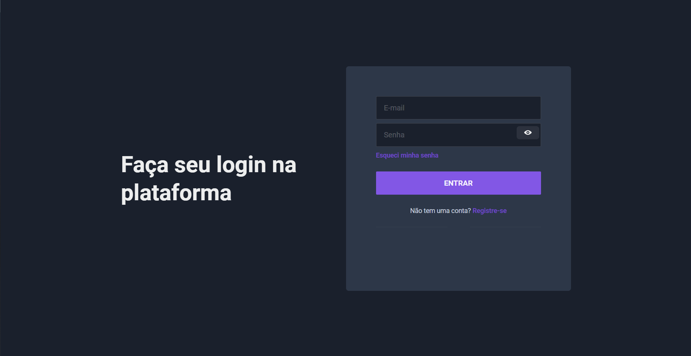
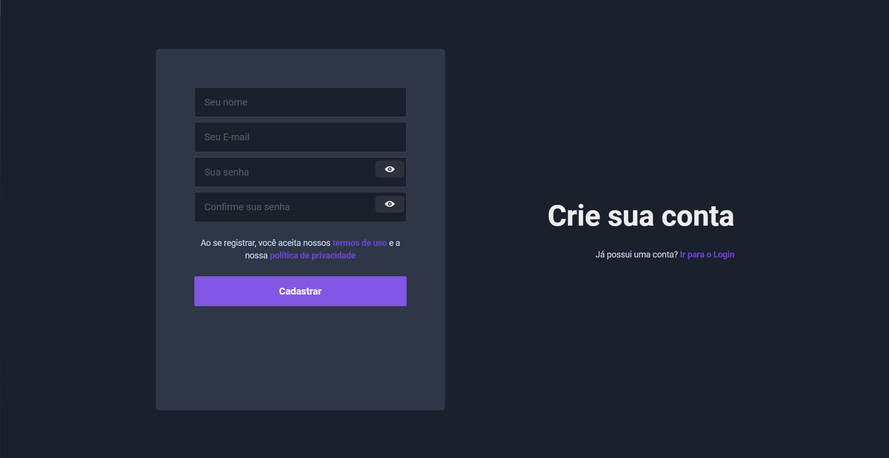
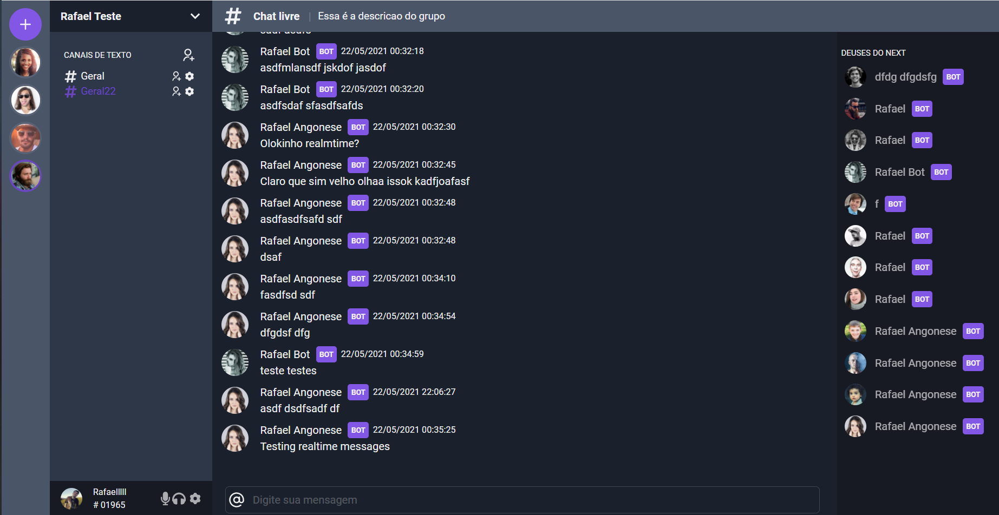

<p align="center">
  
  
</p>

<p align="center">

</p>

## ✨ Tecnologias

Esse projeto foi desenvolvido com as seguintes tecnologias:

-   [Nextjs](https://nextjs.org/)
-   [TypeScript](https://www.typescriptlang.org/)
-   [Chakra-UI](https://chakra-ui.com/)
-   [Socket-io](https://socket.io/)
-   ... e outros

## 💻 Projeto

A estrutura inicial foi feita com base no projeto da Rocketseat [UI Clone - Discord](https://github.com/rocketseat-content/youtube-clone-discord) feito pelo [Guilherme Rodz](https://github.com/guilhermerodz)

Este projeto é um clone simplificado do Discord, ele tem como objetivo aplicar algumas tecnologias de forma prática.

Funcionalidades:

-   CRUDs.
-   Autenticação.
-   Realtime.

## Ambiente de desenvolvimento

```bash
node --version
v16.0.0

yarn --version
1.22.4
```

## 🚀 Como executar

-   Clone o repositório
-   Instale as dependências com `yarn`
-   Inicie o servidor com `yarn dev`
-   A aplicação pode ser acessada em [`localhost:3333`](http://localhost:3333).

-   Execute o Back-end que está [aqui](https://github.com/rafael-angonese/discord-clone-api-adonis)

## 📄 Licença

Esse projeto está sob a licença MIT. Veja o arquivo [LICENSE](LICENSE.md) para mais detalhes.

---

Feito com ♥ by Rafael Angonese
